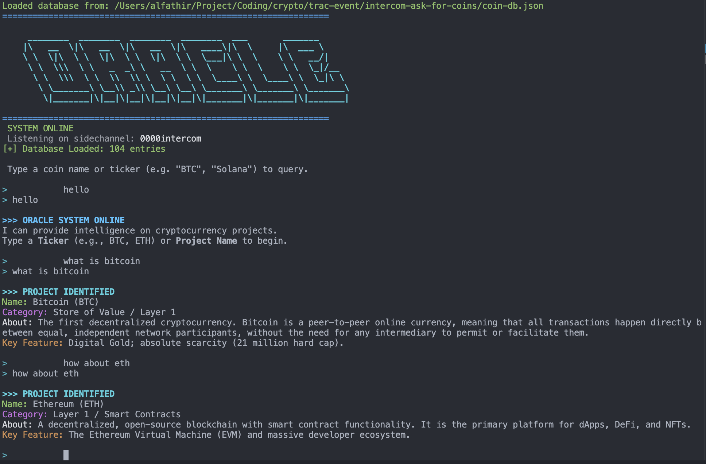

# Oracle Agent: Cryptocurrency Intelligence Interface


The **Oracle Agent** is a decentralized, peer-to-peer application designed to provide instant, accurate cryptocurrency market intelligence. Built on the **Pear Runtime** and leveraged by the **Trac Network**, it serves as a natural-language interface for querying a comprehensive local database of digital assets.

---

## 🛠 Proof of Work (Active Development)



*Snapshot of the Oracle Agent running in a local Pear Runtime environment.*

---

## 🚀 Mission Statement

To bridge the gap between complex blockchain data and user accessibility. The Oracle Agent functions as an on-demand encyclopedia, capable of interpreting natural language queries to deliver concise, factual summaries of over **100+ cryptocurrency projects**.

## 💎 Key Features

-   **Natural Language Processing**: Intelligent query parsing allows users to ask questions in plain English (e.g., *"What is the purpose of Polkadot?"* or *"Tell me about Solana"*).
-   **Zero-Latency Architecture**: Utilizes a local, high-performance JSON database (`coin-db.json`) for instant data retrieval without external API dependency.
-   **Terminal User Interface (TUI)**: Features a polished, interactive command-line interface with simulated ANSI color support for enhanced readability.
-   **Decentralized Deployment**: Fully compatible with the Pear P2P ecosystem.

## 📦 Installation & Usage

This application is designed for the **Pear Runtime** environment.

### Prerequisites

-   [Pear Runtime](https://pears.com) installed.
-   Node.js (for dependency management).

### Quick Start Guide

1.  **Clone the Repository**
    ```bash
    git clone https://github.com/cryptisme/intercom-ask-for-coins.git oracle-agent
    cd oracle-agent
    ```

2.  **Install Dependencies**
    ```bash
    npm install
    ```

3.  **Launch the Agent**
    Execute the following command to start the peer and join the subnet:
    ```bash
    pear run . --peer-store-name oracle_agent --subnet-channel oracle-v1
    ```

### Interactive Query Examples

Once the system is online, interact with the agent using natural language:

```text
> what is btc
>>> PROJECT IDENTIFIED 
Name: Bitcoin (BTC)
Category: Store of Value / Layer 1
About: The first decentralized cryptocurrency...

> tell me about ethereum
>>> PROJECT IDENTIFIED
Name: Ethereum (ETH)
Category: Smart Contracts / Layer 1
...
```

## � Technical Architecture

-   **Runtime**: Pear (Bare)
-   **Language**: JavaScript (ESM)
-   **Data Storage**: Structured JSON (Key-Value Store)
-   **Query Engine**: Custom tokenizer with fuzzy matching capabilities.

## 🏆 Trac Event Submission

This project is a submission for the **Trac Network Event**.

**Wallet Address for Rewards:**
`trac1fh4xuwnu6ut35ffgwe5d3tt7cruvkrxt5vp8ddc3gdkkd4hp97uszw9ys4`

## 📜 License

This project is licensed under the **MIT License**.

---
> **Disclaimer**: The information provided by this tool is for educational purposes only and does not constitute financial advice. Always Do Your Own Research (DYOR).
